# E-Library - App mini catatan perpustakaan (PHP)
Bookshelf adalah sebuah aplikasi mini crud tentang catatan perpustakaan. 

## Role
- admin: semua bisa akses
- petugas : semua bisa akses kecuali menu petugas
- siswa : hanya bisa melihat history peminjaman

## Testing 
- admin

username: admin

password: 123 

- petugas

username: test_petugas

password: test

- siswa

username: test

password: test


## Persiapan 
1. Node.js v20.18.2 ([ Node.js](https://nodejs.org/en/download)) 
2. PHP 8.0+ atau 8.3.8 (([xampp](https://www.apachefriends.org/download.html) atau [laragon](https://laragon.org/download/)))
3. MySQL atau MariaDB 
4. GIT (Opsional) 

### - Clone Repository   
1. Buka file manager / Finder / file explorer
2. Kemudian masuk ke folder tempat `xampp\htdocs` (XAMPP) atau `laragon\www` (Laragon)
3. Lalu klik kanan pada area kosong lalu pilih `Open in Terminal` atau pilih `git bash`
4. Kemudian, jalankan perintah dibawah ini : 

```bash
git clone https://github.com/ArielGwd/UTS_IMK_KELOMPOK1.git
cd UTS_IMK_KELOMPOK1
``` 

jangan lupa import database [e-library.sql](e-library.sql)

kemudian ke browser buka `http://localhost/UTS_IMK_KELOMPOK1/`

### - Install Dependency
jika node_modules dan css tidak ada atau beberapa fungsi tidak bisa digunakan, jalankan perintah dibawah ini :
```bash
npm install
npm run watch 

// atau 

npm run build 

``` 

kemudian buka browser kembali `http://localhost/UTS_IMK_KELOMPOK1/`. Setelah itu, cek kembali apakah bisa digunakan tombol-tombol dan beberapa fungsi lainnya

## Fitur
- Create
- Read
- Update
- Delete
- Search ([datatables library](https://datatables.net/))
- Pagination ([datatables library](https://datatables.net/)) 

## Tech stack
[](https://skillicons.dev) 

## Preview  
1. Dashboard

 
2. Book Page
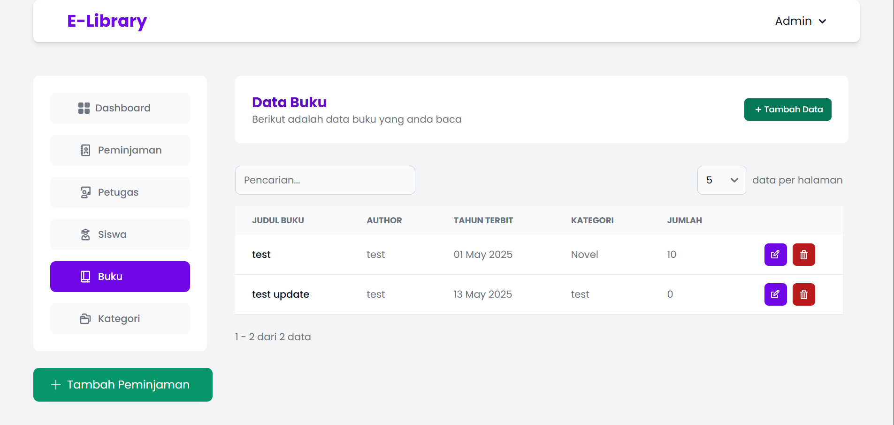

3. Add Book Modal
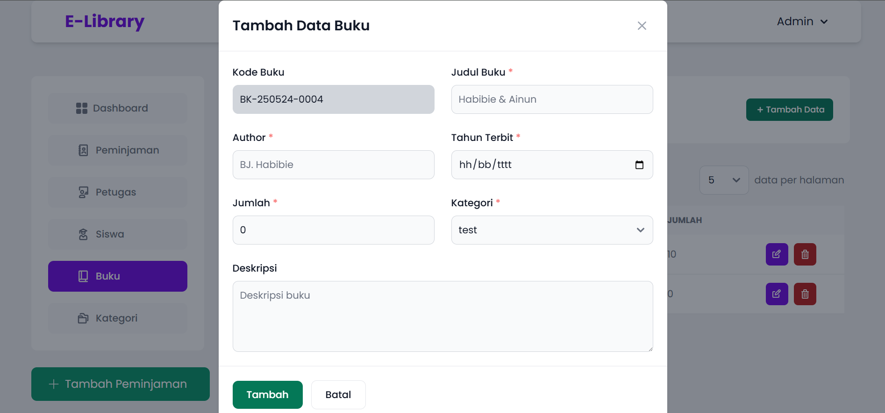

4. Edit Book Modal


5. Category Page
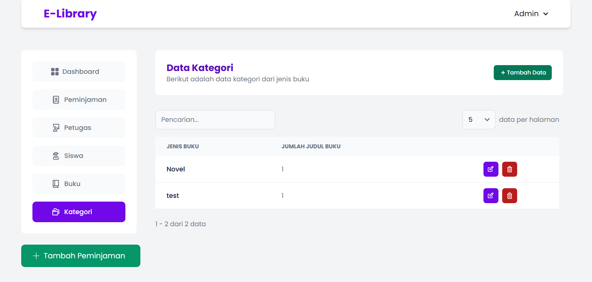

6. Add Category Modal
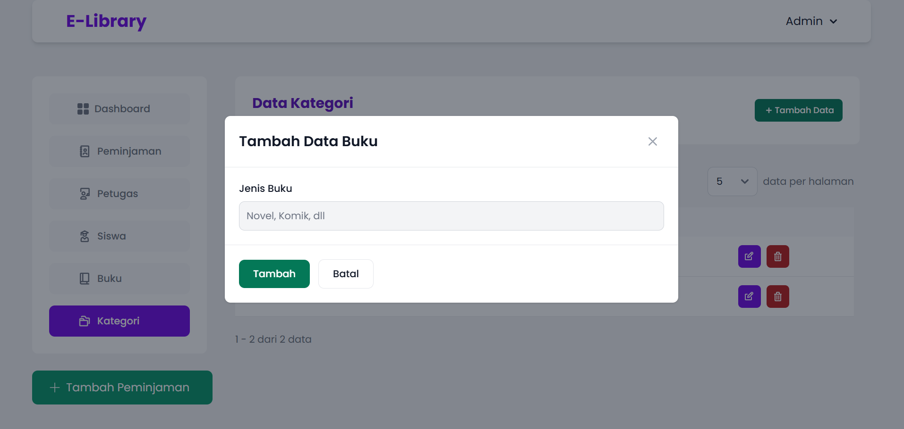

7. Edit Category Modal
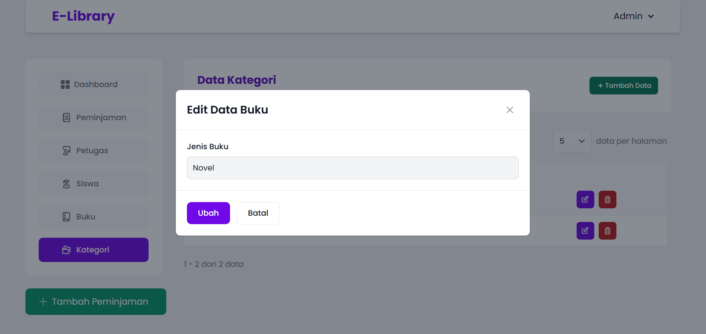

8. Siswa Page
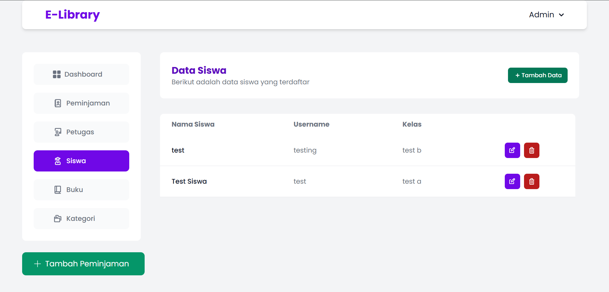

9. Add Siswa Modal
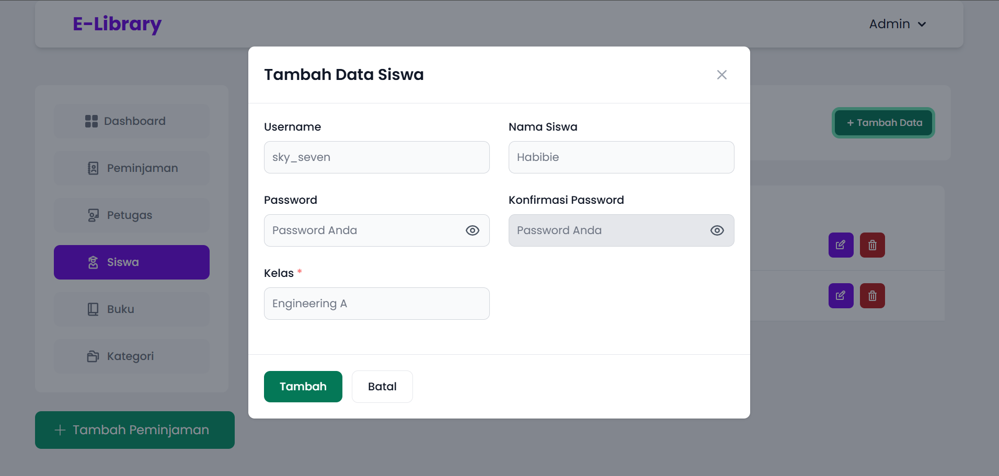

10. Edit Siswa Modal
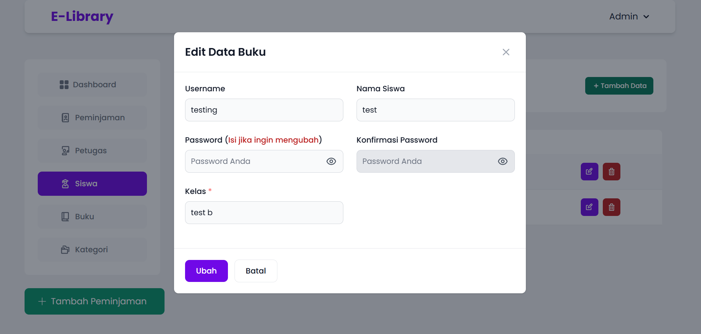

11. Petugas Page
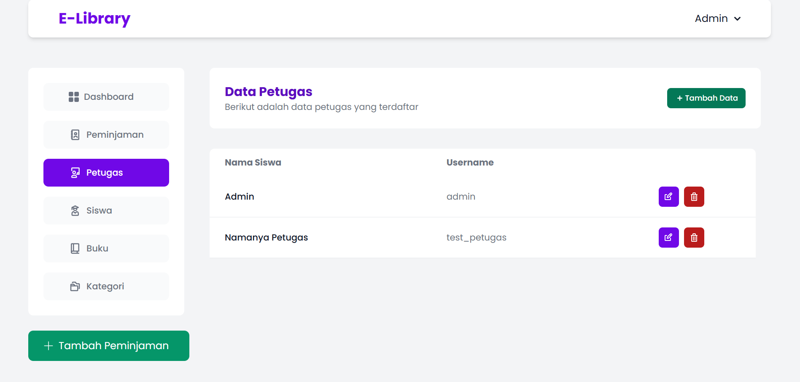

12. Add Petugas Modal
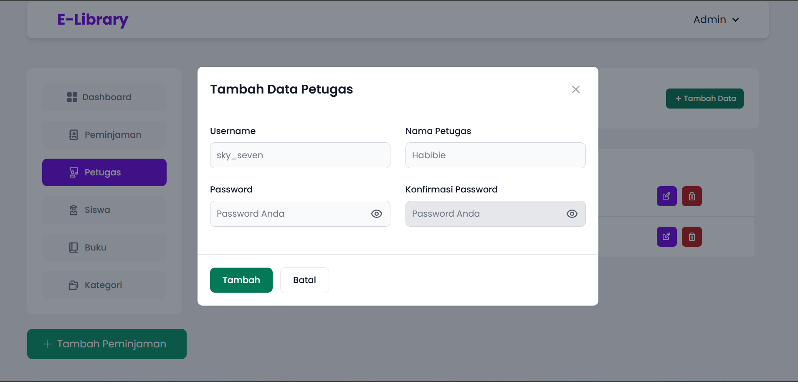

13. Edit Petugas Modal
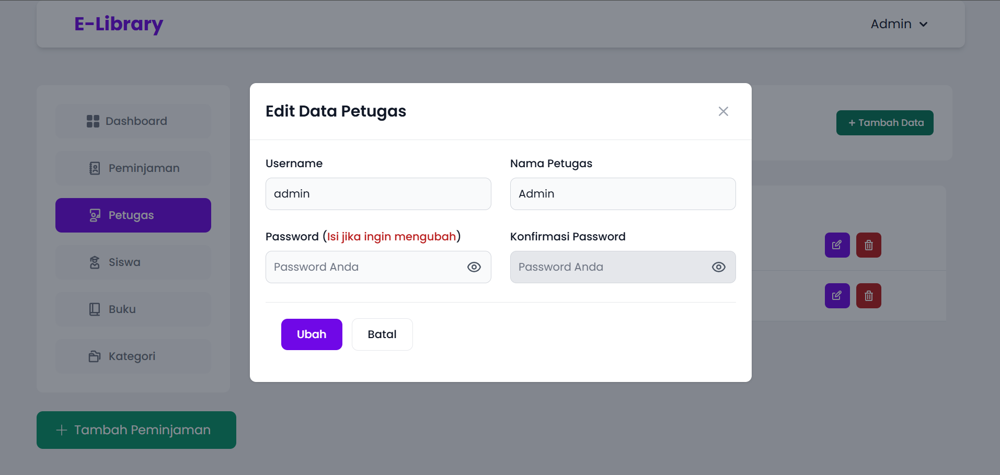

14. Peminjaman Page
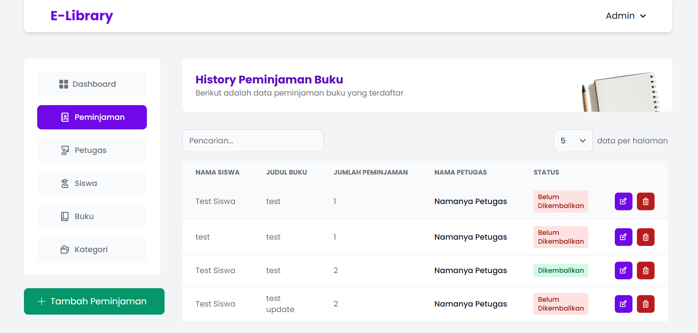

15. Add Peminjaman Modal
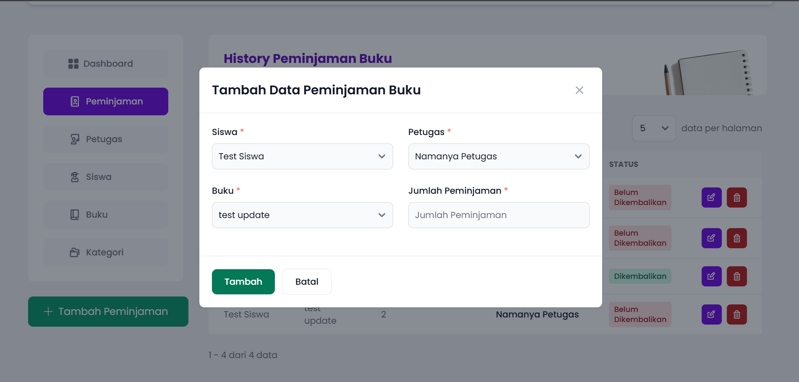

16. Edit Peminjaman Modal
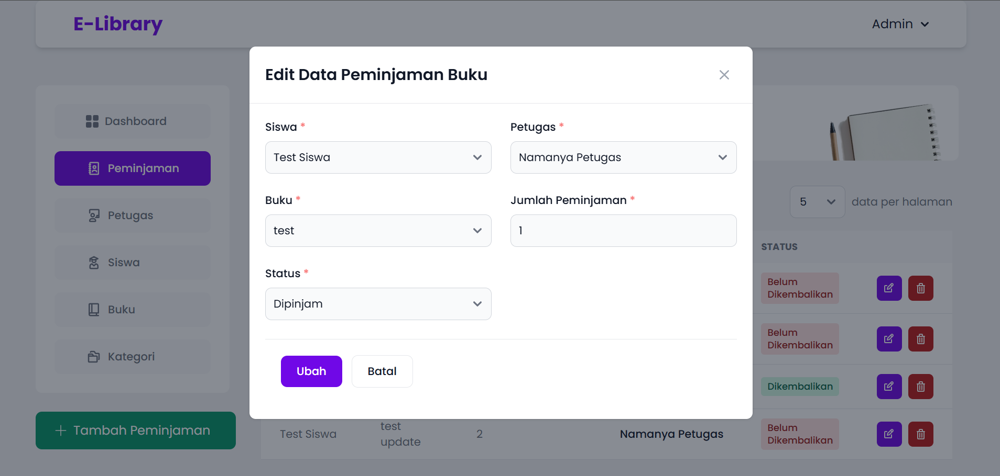

17. Login Page
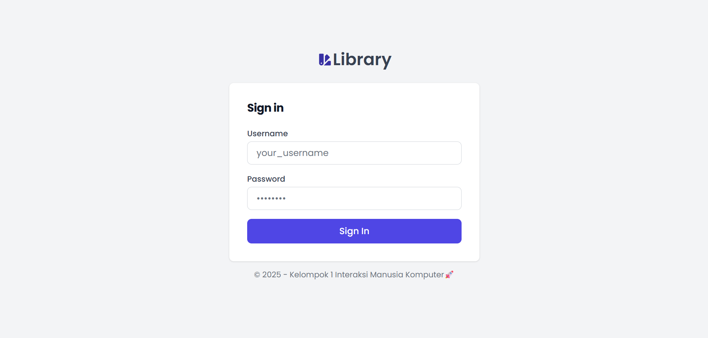

18. Logout Page
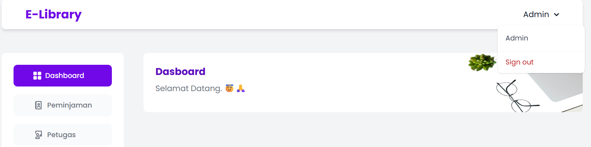
 
19. Menu yang tersedia dari role petugas
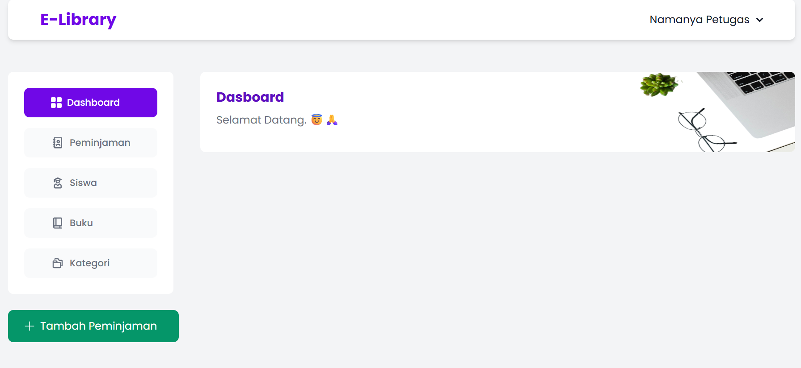

20. Menu yang tersedia dari role siswa
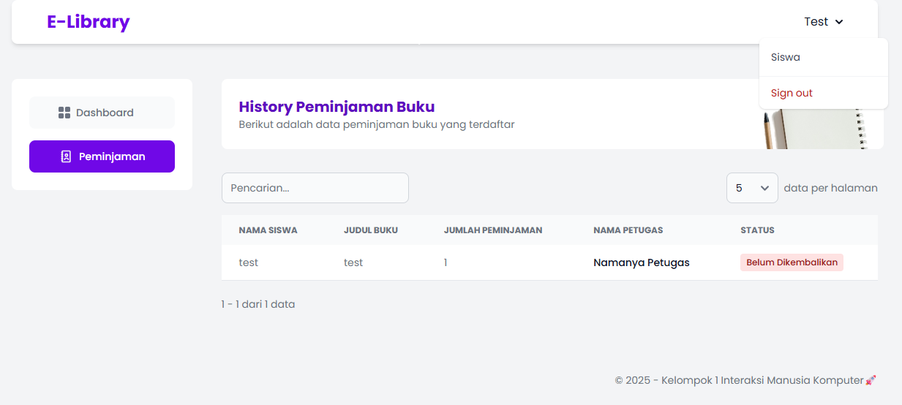


